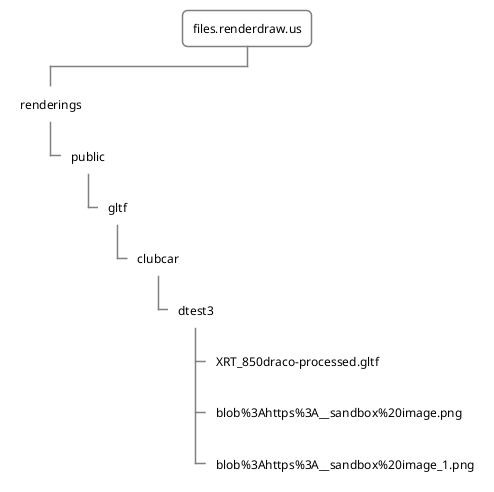
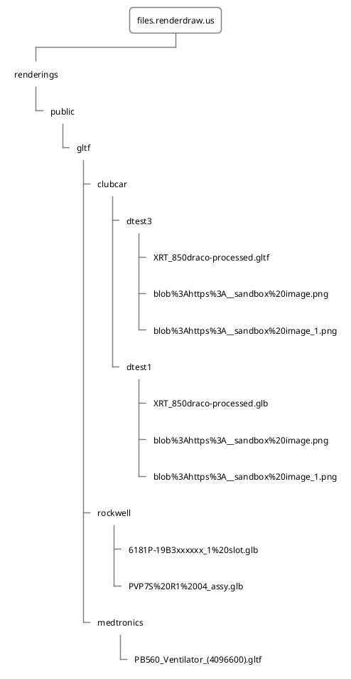

# Why Relationships 

If you are hosting your drawings & files on a remote server, check out their URLs. For us it looks something like this for a single 3D product visualization scene

````
https://files.renderdraw.us/renderings/public/gltf/clubcar/dtest3/XRT_850draco-processed.gltf
https://files.renderdraw.us/renderings/public/gltf/clubcar/dtest3/blob%3Ahttps%3A__sandbox%20image.png
https://files.renderdraw.us/renderings/public/gltf/clubcar/dtest3/blob%3Ahttps%3A__sandbox%20image_1.png
````

Notice anything?
Let's take a look another way


We are using remote resources like a file system in order to load 3D files for use with Salesforce. This is particularly useful when loading related assets such as textures and materials that are associated but not included in the converted 3D Drawing. 

In the files above, we are utilizing the same file server hosted at https://files.renderdraw.us/. From there we separate into “renderings” and “public”  sub directories, and on and on until we reach our actual file to render, in this case **XRT_850draco-processed.gltf**. 

All of these files relate to a single drawing, and when we attempt to scale storing these for every product your organization will ever have, it starts becoming daunting. At the end of the day, whenever we interact with data within Salesforce, there might be an associated 3D drawing that should be displayed. 

Let's take a look at how complex this can get by adding another 4 records to Salesforce that have representative 3D files & relationships.

````
Product 1:
	https://files.renderdraw.us/renderings/public/gltf/rockwell/6181P-19B3xxxxxx_1%20slot.glb
Product 2:
	https://files.renderdraw.us/renderings/public/gltf/rockwell/PVP7S%20R1%2004_assy.glb
Product 3:
	https://files.renderdraw.us/renderings/public/gltf/medtronics/PB560_Ventilator_(4096600).gltf
Product 4: 
	https://files.renderdraw.us/renderings/public/gltf/clubcar/dtest1/XRT_850draco-processed.glb
  https://files.renderdraw.us/renderings/public/gltf/clubcar/dtest1/blob%3Ahttps%3A__sandbox%20image.png
  https://files.renderdraw.us/renderings/public/gltf/clubcar/dtest1/blob%3Ahttps%3A__sandbox%20image_1.png

````
or visualized:



Notice how the size of the tree balooned? Many times references to 3D files are many to one, so it can be said for every record added to salesforce of a given type that requires 3D visualization 
With RenderDraw's relationship management, these 3D drawings can be shared between different objects usages several objects within Salesforce.

# Relationship Strategies

# Create a Relationship

## Create a RenderDraw Setting

## Create a Re


