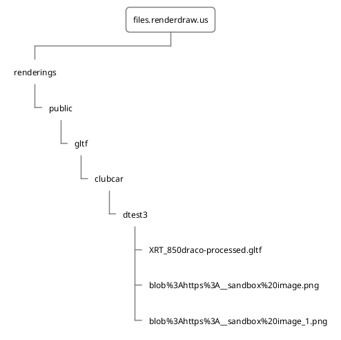
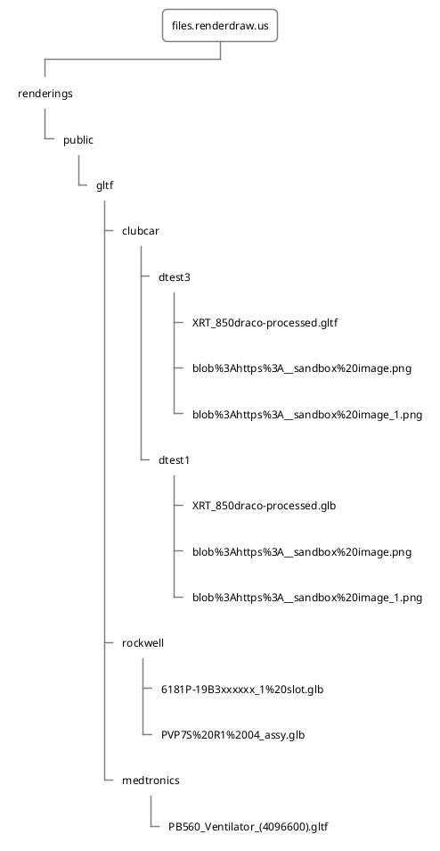
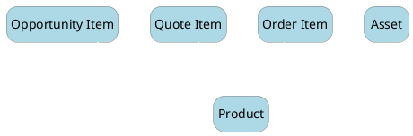

# Why Relationships? 

If you are hosting your drawings & files on a remote server, check out their URLs. For us it looks something like this for a single 3D product visualization scene

````
https://files.renderdraw.us/renderings/public/gltf/clubcar/dtest3/XRT_850draco-processed.gltf
https://files.renderdraw.us/renderings/public/gltf/clubcar/dtest3/blob%3Ahttps%3A__sandbox%20image.png
https://files.renderdraw.us/renderings/public/gltf/clubcar/dtest3/blob%3Ahttps%3A__sandbox%20image_1.png
````

Notice anything?
Let's take a look another way


We are using remote resources like a file system in order to load 3D files for use with Salesforce. This is particularly useful when loading related assets such as textures and materials that are associated but not included in the converted 3D Drawing. 

In the files above, we are utilizing the same file server hosted at https://files.renderdraw.us/. From there we separate into “renderings” and “public”  sub directories, and on and on until we reach our actual file to render, in this case **XRT_850draco-processed.gltf**. 

All of these files relate to a single drawing, and when we attempt to scale storing these for every product your organization will ever have, it starts becoming daunting. At the end of the day, whenever we interact with data within Salesforce, there might be an associated 3D drawing that should be displayed. 

Let's take a look at how complex this can get by adding another 4 records to Salesforce that have representative 3D files & relationships.

````
Product 1:
	https://files.renderdraw.us/renderings/public/gltf/rockwell/6181P-19B3xxxxxx_1%20slot.glb
Product 2:
	https://files.renderdraw.us/renderings/public/gltf/rockwell/PVP7S%20R1%2004_assy.glb
Product 3:
	https://files.renderdraw.us/renderings/public/gltf/medtronics/PB560_Ventilator_(4096600).gltf
Product 4: 
	https://files.renderdraw.us/renderings/public/gltf/clubcar/dtest1/XRT_850draco-processed.glb
  https://files.renderdraw.us/renderings/public/gltf/clubcar/dtest1/blob%3Ahttps%3A__sandbox%20image.png
  https://files.renderdraw.us/renderings/public/gltf/clubcar/dtest1/blob%3Ahttps%3A__sandbox%20image_1.png

````
or visualized:



Notice how the size of the tree balooned? Many times references to 3D files are many to one, so it can be said for every record added to Salesforce of a given type that requires 3D visualization, at least one relationship will have to be maintained. Writing this relationship 
With RenderDraw's relationship management, these 3D drawings can be shared between different objects and usages within Salesforce. Common examples of this would be 
- 3D Visualization on a product object 
- Configuration on a Quote Line object 
- Self-Service on a Asset Item through a Salesforce Community. 

The underlying drawing doesn't change, only the usecase and object on Salesforce did.


# What is a RenderDraw Relationship? 
In order to scale the amount of objects we could reasonably display 3D models for, along with scale to the different situations you would want to interact with a 3D component, we have created a grouping of relationship objects that map to a given object in Salesforce that is User determined.
  

From these objects, a schema can be derived, where applicable fields are selected that contain either subsections or locations  of the subsections of a URL of your 3D drawing. 

Lets jump in and learn how to create relationships between a Salesforce object and a 3D drawing source. 

# Create a Relationship
Think of a RenderDraw relationship like a formula. This formula determines, by object, how we are going to fetch your 3D files and related resources for a given Salesforce Object record. At the end of the day, we are looking for a file in a remote destination, from the example above, we can break down the URL into its composite parts.


Based on a set of fields mapped with the relationship objects, we can compose a URL for every product record that exists for any company. The relationships are maintained alongside the data in Salesforce, so as the records in the Salesforce org gradually grow in number, the most up-to-date drawing is updated on each record by convention, ensuring a scalable experience for every record of that type.    

Lets prove this by adding a 3D interaction onto multiple record types Lightning pages. Then we'll update the filename reference and display the results on all references.  

## Create a RenderDraw Setting
- Setup
Go to setup and search for Metadata
- Search for Metadata

- manage the relationships 
- create the relationship


## Create a Relationship Setting
- Setup
- Search for Metadata

- manage the relationships 
- create the relationship


## Render from your Relationship
Add a component to the record detail screen and save it using the lightning 
# Relationship Strategies
Using the right tool for the job is of the utmost importance.  

## What are you visualizing?
If you are planning to render a single product or scene for your entire org, you likely do not need a relationship strategy or a relationship at all. Relationships are for scaling 3D over the size of a particular object type. 

Most frequently, you will likely be visualizing products in either sales or service scenarios.  

## Where are you going to want to render?
Our default strategy when setting up product-related 3D to scale is based on the Product Object. 

With this in mind, we can potentially further re-utilize data to ensure when a new rendering path is available, we have a single source of truth for that product.
### The power of Salesforce lookups 


## Tips
For easy conditional rendering for a component based on relational rendering, add an additional field to your  


