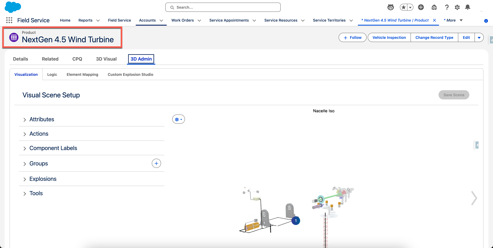

# Interactive Product Guidance

**Prerequisites**

1. Base RenderDraw setup completed
   1. Instructions here: [Getting Started With RenderDraw](../../../../../../getting-started-with-renderdraw/)

**Set Up A Guided Product Explosion**

1. Navigate to the desired Product record
   1.

       <figure><figcaption></figcaption></figure>

2. Navigate to RenderDraw 3D Admin tab (created earlier in general setup)
   1.

       <figure><figcaption></figcaption></figure>

3. Navigate to sub tab called "Custom Explosion Studio"
   1.  \

       <figure><figcaption></figcaption></figure>

4. Click "Add Custom Explosion"
   1.

       <figure><figcaption></figcaption></figure>
5. Create/Add A Frame and click the pencil icon to edit the specific frame
   1.

       <figure><figcaption></figcaption></figure>

6. Adjust camera, click on specific piece of model and/or use the Elements tab to find the specific piece of the model, and create annotation to describe the given step or area
   1. Annotations can reference text, image url, video url, or other link
      1.

          <figure><figcaption></figcaption></figure>
7. Click "Set Camera" and Click "Save"&#x20;
   1.

       <figure><figcaption></figcaption></figure>

8. Repeat to create as many frame as neccessary
