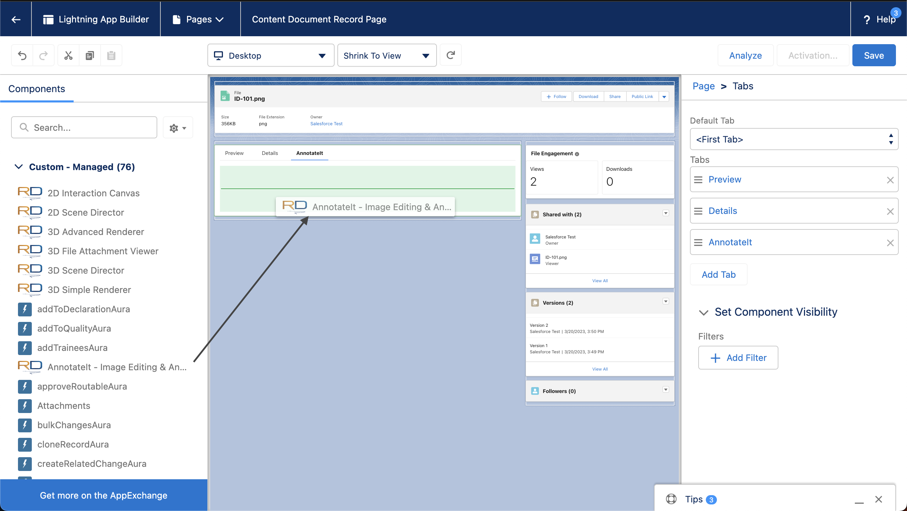
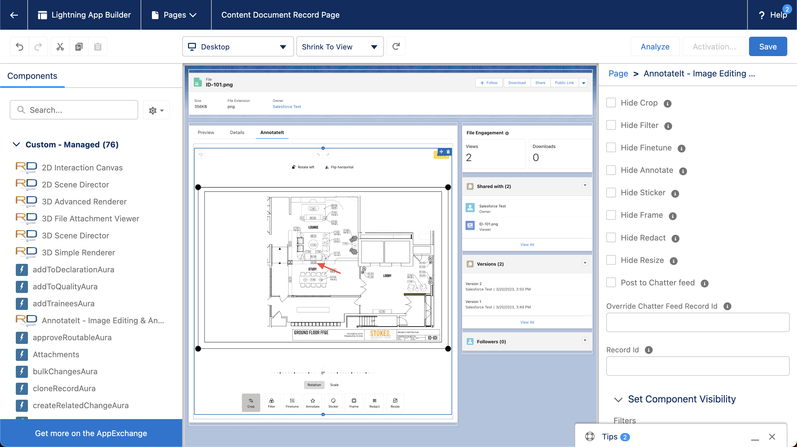

# Initial Setup

### Install Propel Managed Package

Get this link from the Propel team. Renderdraw for Propel requires version 8.8.1 or greater.

### Install RenderDraw Managed Package 3.40 or later&#x20;

Get this link from the Propel team

#### Install the RenderDraw for Propel Package (version 0.3.0) or later

Get this link from the Propel team

**Add RenderDraw Licenses to the specified users**

<figure><figcaption></figcaption></figure>

<figure><figcaption></figcaption></figure>

### Add Permission Sets to the users you want interacting with visuals.

<figure><figcaption></figcaption></figure>

Add included quick actions to the Item page.

<figure><figcaption></figcaption></figure>

Optionally, you can update the Content Document Page to include the AnnotateIt component for editing Images

<figure><figcaption>
Drag the AnnotateIt Component into a new tab or on the page. The record will be detected automatically
</figcaption></figure>

<figure><figcaption>
Remember to Save and Activate the page with the new components added
</figcaption></figure>

